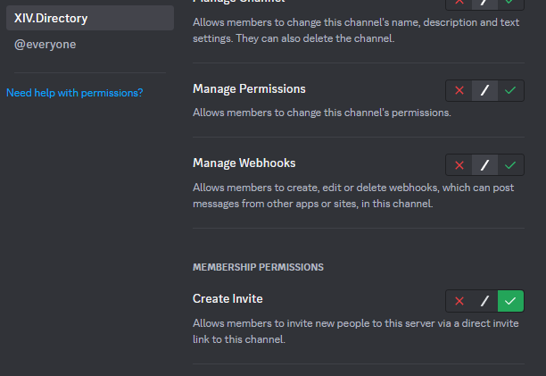

# XIV Directory Discord Bot
This provides the source code for the Discord bot backing the [XIV Directory](https://xiv.directory)

# Permissions
The bot requires the "Create Invite" server permission to run, and future optional features will require the "Manage Webhook" feature

When setting up the bot, it may also require being given "Create Invite" permissions on a specific channel (usually the rules channel), if the permission has been explictly denied to `@everyone` on that channel

You can use the `/checkinvite` command to validate if the permissions are already set up, or if they need additional configuration